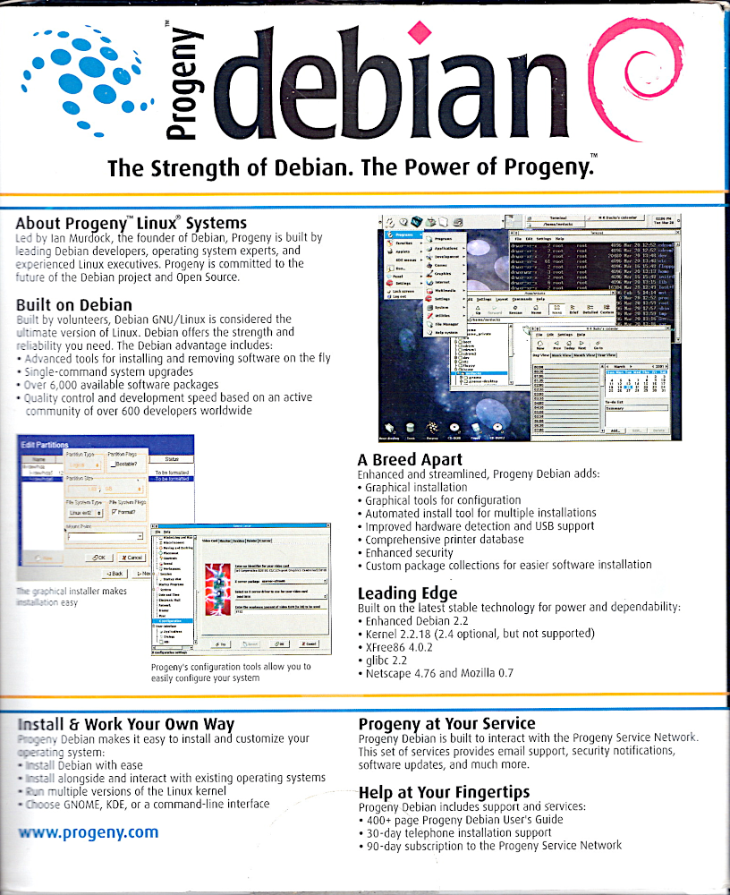

# Ian Murdock's Progeny Debian GNU/Linux

Ian Murdock's Progeny Debian GNU/Linux - the ultimate version of GNU/Linux

Progeny Debian Box - Front |  Progeny Debian Box - Back
:-------------------------:|:-------------------------:
  |  

- Content: 4 CDs, Manual (Printed Book), 2 (Bootup) Floppy Disks
- License: the license information can be found on the given disks and sources

# The Strength of Debian. The Power of Progeny.

## About Progeny Linux Systems
Led by lan Murdock, the founder of Debian, Progeny is built by leading Debian developers, operating system experts, and experienced Linux executives. Progeny is committed to the future of the Debian project and Open Source. 

## Built on Debian
Built by volunteers, Debian GNU/Linux is considered the ultimate version of Linux. Debian offers the strength and reliability you need. The Debian advantage includes: 
- Advanced tools for installing and removing software on the fly
- Single-command system upgrades
- Over 6,000 available software packages
- Quality control and development speed based on an active community of over 600 developers worldwide

## A Breed Apart
Enhanced and streamlined, Progeny Debian adds:
- Graphical installation
- Graphical tools for configuration
- Automated install tool for multiple installations
- Improved hardware detection and USB support
- Comprehensive printer database
- Enhanced security
- Custom package collections for easier software installation 

## Leading Edge
Built on the latest stable technology for power and dependability:
- Enhanced Debian 2.2
- Kernel 2.2.18 (2.4 optional, but not supported)
- XFree86 4.0.2
- glibc 2.2
- Netscape 4.76 and Mozilla 0.7

## Install & Work Your Own Way
Progeny Debian makes it easy to install and customize your operating system:
- Install Debian with ease
- Install alongside and interact with existing operating systems
- Run multiple versions of the Linux kernel
- Choose GNOME, KDE, or a command-line interface

## Progeny at Your Service
Progeny Debian is built to interact with the Progeny Service Network. This set of services provides email support, security notifications, software updates, and much more.

## Help at Your Fingertips
Progeny Debian includes support and services:
- 400+ page Progeny Debian User's Guide
- 30-day telephone installation support
- 90-day subscription to the Progeny Service Network

www.progeny.com (ceased operations April 30, 2007)
https://web.archive.org/web/20070506131659/http://www.progeny.com/ (Archive - Link)
